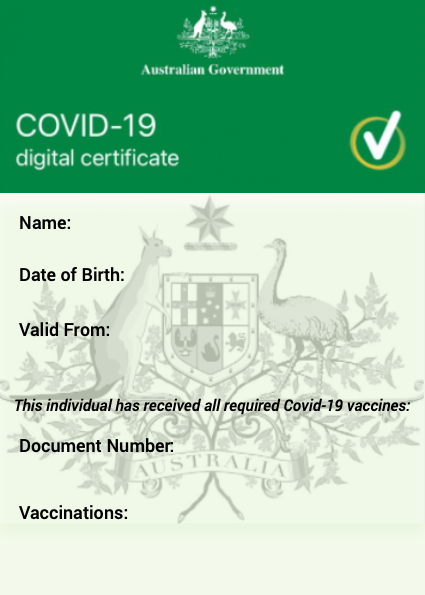
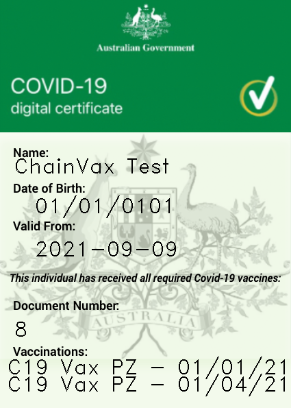

# ChainVax

## Introduction: 

## Objectives:

- Analyse Covid-Infection Rate 
- Simulate future Covid-Infections
- Build smart contract for Vax Records
- Generate Vax Digital Certificate & QR Code  

---
## Analyse Covid Infeciton Rate:

COVID19 data was collected from https://data.nsw.gov.au/nsw-covid-19-data.

Cleaned up data to remove null values and 'Masked' data.

Using pgeocode, iterate through the data frame index and collect longitutde and latitude values from the postcodes.

Prepare data frame by setting the date as the index, adding a count column and dropping unused columns.

Plot the data on a mapping of NSW using the longitutde and latitude data to show which areas are most affected by COIVD19.

---
## Projection of Future Daily Cases:

To understand the likely projection of Daily Covid cases we developed a two main scenarios 1) Projection of Covid Cases across the next 14 days and 2) Projection of Covid Cases across 30 days. 

To do this, we adopted a Monte Carlo simulation and ran 20 simulations across both options to understand how serious Covid Cases would grow. We used both the standard deviation and mean from the last 14 days of actual data to make these projections. 

The results were surprising and illustrated some diar worst case scenarios. 

Daily cases if left with the same trajectory as the last 14 days of actual data, our Monte Carlo simulations suggested that in 14 days, maxim daily cases could reach 2,927 cases per day. 

The 30 day scenario projected a potential maxim daily cases of 11,908 cases per day.

Whilst these are the worst case scenarios, these illustrated the dangers of leaving Covid-19 uncontrolled. 

The ChainVax team set out to achieve a seamless way to ensure your vaccination data is kept safe and easily accessible when required to provide details of your vaccination. Using the benefits of BlockChain technology, we set out to digitise Vaccination records. 

---

## Implementing a ChainVax certificate:

## Solidity - Contract - Deploying the NFT:

- To finalise our ChainVax process onto the blockchain, we incorporated a Solidity Contract using the Remix IDE.

- The ChainVax contract runs on version 0.5.5 and inherits from the ERC721Full and Counters contract. 

- There is a struct for variables we require from the patient followed by a registerVaccination function. 

- The function contains a few uses such as token id increasing by 1 every time a new person gets vaccinated, minting the non-fungible token with the variable input and transferring that NFT to the wallet address of the person who got vaccinated.

- The team chose to keep it simple with only one function encompassing the entire use cases mentioned above to minimise interaction between the Python script and Solidity to reduce potential mistakes. 

- When the contract is deployed, there are a few settings to be updated in the python script before the ChainVax blockchain can be utilised. 

- Firstly, the ABI will have to be updated in the JSON file. 

- Next, the newly deployed contract address also needs to be changed in the top of our python script variables. 

- Finally, please ensure that the operator address for the entire ChainVax procedure remains constant as the ChainVax contract requires the owner’s address to operate.

- Besides the registerVaccination function mentioned, the other function heavily used is called totalSupply and these two remain the most important function for our project. 

- The totalSupply function is vital to ensuring our minting records are updated properly as we are using the python script to extract the token id information from the ChainVax contract using the totalSupply function which contains the total index length of tokens in the contract that has been minted.

## Converting Variables and Cert into URI for Solidity:

## Generation of Covid Certificate:

On this project we have used a new library called OpenCV

Is a huge open-source library for computer vision, machine learning, and image processing. It can process images and videos to identify objects, faces, or even the handwriting of a human. When it integrated with various libraries, such as NumPy, python is capable of processing the OpenCV array structure for analysis. To Identify image pattern and its various features and perform mathematical operations on these features. 

As you can see on the image below, this temple was created through an external designing application, then we read the image using OpenCV library and given the parameters needed for the Vax Certifica… such as name, dob, valid from, Doc num & vaccinations, in other to do that we provided some coordinates to our function so it can display all different texts on the exact location anytime when a certificate is created...

## Generation of QR Code:

Qrcode is a two-dimensional pictographic code used for its fast readability and comparatively large storage capacity. 

We used this new library within Python to store our Vaccination Certificate once the URI has been sent from pinata… 

Some of the parameters used to define the QR Code were:

- Box Size = Parameter that controls how many pixels each “box” of the QR code is
- Border = Parameter that controls how many boxes thick the border should be
- Version = 1
- Fill Colour
- Back Colour
- Add data = URI link
- Make and save it

## Vaccination Certificate QrCode:

## Vaccination Certificate:

